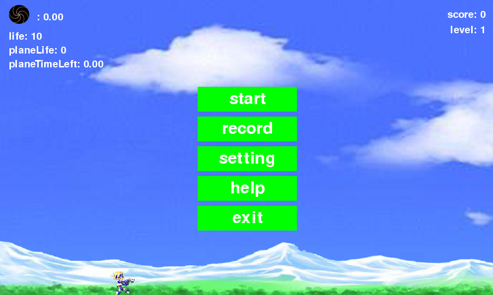
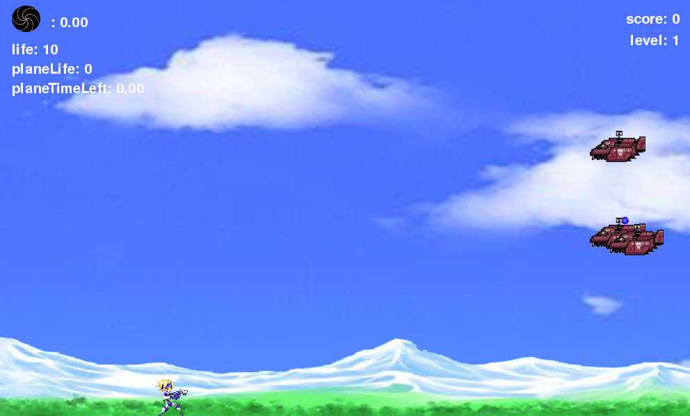

# pygame_demo

a 左 d右  j跳 k发射  i上调子弹方向 o下调  u技能
n降落，j跳离，w,s上下

-----------------------------------------------------------------
一开始菜单界面（鼠标选择）
开始游戏
成就（历史最高分，钻石数）
设置（场景，静音）
帮助（规则，按键）
退出

游戏界面显示信息：
1.没有开敌机时：life score 技能图标(冷却完成时亮，否则暗） 
  左上那3个人换成3个小图标 
2.开敌机时：life planeLife planeTimeLeft score 技能图标 左上那3个小图标 

---------------------------------------------
2018/06/19  hdr
菜单已基本写了
成就写成记录，只有分数，有待完善
帮助界面得再完善
设置只能设音乐开关

技能图标考虑到不知道有多少次技能，而且不是很懂技能怎么获得及消失，所以还没写
开敌机的那个，个人觉得就那样显示就好，不用专门隐藏，最好精确到小数点后1到2位，不知道上次被改了哪里

修改了背景音乐的播放，在运行后即开始播放音乐

运行截图：

